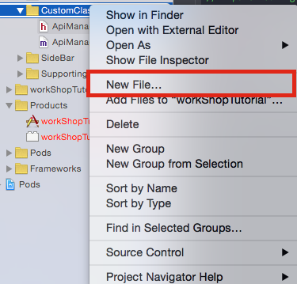
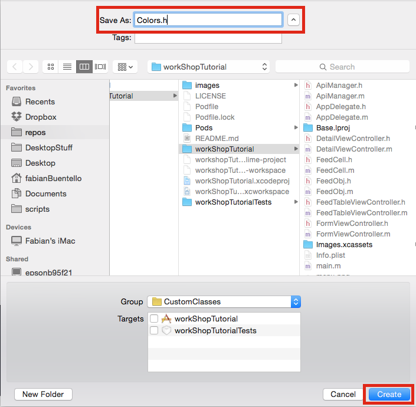

# UH iOS Workshop

## Prerequisites

Make sure you have installed all of the following prerequisites on your development machine:

- Xcode - [Download & Install Xcode 7](https://developer.apple.com/xcode/download/).
- Git - [Download & Install Git](https://git-scm.com/downloads)
- CocoaPods - [CocoaPods](https://cocoapods.org/) is the dependency manager for Swift and Objective-C Cocoa projects.

To install CocoaPods, you must have `Homebrew` installed on your Mac. Open the Terminal and run the following command:

```bash
$ ruby -e "$(curl -fsSL https://raw.githubusercontent.com/Homebrew/install/master/install)"
```
Once `Homebrew` has installed, you will need to install CocoaPods with the following command:

```bash
$ sudo gem install cocoapods
```

### Cloning The GitHub Repository
The recommended way to get workshopTutorial is to use git to directly clone the workshopTutorial repository **and start off at Chapter 1**:

```bash
$ git clone https://github.com/fbuentello/workshopTutorial.git -b startChapter1
```

Don't forget to `cd` into the directory:

```bash
cd workshopTutorial/
```

## Quick Install
Once you've cloned workshopTutorial and installed all the prerequisites, you're just a few steps away from getting starting.

The first thing you should do is install the Pod dependencies. The repo comes with a `Podfile` that contains the list of dependencies you need to start your application.

To install the Pod dependencies, open up a Terminal in the application folder run this in the command-line:

```bash
$ pod install
```
This may take a minute, but once complete, you should have a few new files in your directory. Be sure to close out any Xcode sessions as it should say on the terminal:

``` bash
"[!] Please close any current Xcode sessions and use `workShopTutorial.xcworkspace` for this project from now on."
```
Next open up the `workShopTutorial.xcworkspace` in Xcode, and Let's get started.

##Chapter 1

With the project open, **Run/Build** the tutorial on the simulator. Everything works fine, but as you see, we're getting some warnings. Don't worry, I put those warning there.


We'll be fixing the **FIX:Colors** warning in Chapter 1.

### FIX:Colors

Example:
```objective-c
fullName.textColor = [UIColor colorWithRed:85.0/255.0 green:172.0/255.0 blue:238.0/255.0 alpha:1.0];
```

I found this to be a bad practice in the case that you want to update the color scheme across your entire app or even trying to remember what color this even is. You'll find yourself doing this alot when first developing the app. In storyboard, you can set the `backgroundColor` of a `UIView` to help you visually, just be sure to **set the `backgroundColor` in the Controller**.

#### Colors Solution

The solution was inspired from my time doing web development, in particular, using CSS frameworks like [SASS](http://sass-lang.com/) or [LESS](http://lesscss.org/)(You don't have to read up on them). Using those frameworks, I learned about setting **`Color variables`**. So if I wanted to change my `mainColor`/`baseColor`, all I had to do is change the color at one location, and it would update across my entire app. This definitely helps with consistency. If you want to learn more about color schemes and palettes, checkout [tuts+ Color Theory article](http://webdesign.tutsplus.com/articles/an-introduction-to-color-theory-for-web-designers--webdesign-1437).

I'm going to save us both some time and tell you that we are going to create 2 new header files, **`Colors.h`** and **`Config.h`**. `Config.h` will be explained a bit later on in the tutorial, but preform the following steps on your project.

===========

###Step 1

**Select New file**



**Select Header file**


**Create New file**



At the end, you should have two new files(**`Colors.h`**, **`Config.h`**) in your `CustomClasses` group.

Open up `Config.h` and import `Colors.h`, your file should look like so:

```objective-c
//
//  Config.h
//  workShopTutorial
//
//  Created by Fabian Buentello on 9/28/15.
//  Copyright © 2015 Fabian Buentello. All rights reserved.
//

#ifndef Config_h
#define Config_h

#import "Colors.h"

#endif /* Config_h */
```

### Step 2

Go back to your warnings section.


In each file that has the **`FIX:Colors`** warning, uncomment the line where we import `Config.h`.

```objective-c
#import "config.h"
```

Next we need to set our color variables in our `Colors.h`, I took the liberty to go ahead and do that for you. We will also be using a very popular macro, `UIColorFromRGB`. It uses hexadecimals instead of RGB which I personally find much easier to remember. With that being said, your `Colors.h` should look like this:

```objective-c
//
//  Colors.h
//  workShopTutorial
//
//  Created by Fabian Buentello on 9/28/15.
//  Copyright © 2015 Fabian Buentello. All rights reserved.
//

#ifndef Colors_h
#define Colors_h

#define UIColorFromRGB(rgbValue) [UIColor colorWithRed:((float)((rgbValue & 0xFF0000) >> 16))/255.0 green:((float)((rgbValue & 0xFF00) >> 8))/255.0 blue:((float)(rgbValue & 0xFF))/255.0 alpha:1.0]    //hex converter


#define baseColor UIColorFromRGB(0x81d4dc)

#define baseComplementColor UIColorFromRGB(0x46898F)

#define subColor UIColorFromRGB(0xf04943)

#define sideBarBackground UIColorFromRGB(0x3f3f3f)

//Colors
#define whiteColor UIColorFromRGB(0xffffff)

//TWITTER COLORS link: https://about.twitter.com/company/brand-assets
#define twitterColor UIColorFromRGB(0x55acee)
#define twitterDark UIColorFromRGB(0x292f33)
#define twitterGrey UIColorFromRGB(0x66757f)
#define twitterLightGrey UIColorFromRGB(0xccd6dd)

//FACEBOOK COLORS
#define facebookColor UIColorFromRGB(0x3b5998)

//LINKEDIN COLORS
#define linkedInColor UIColorFromRGB(0x0173b2)

#endif /* Colors_h */
```

As you see, I'm using the [Twitter's color palette](https://about.twitter.com/company/brand-assets). We will be using their colors in our feed, I mean, why not? They do it better than anybody else.

Also, I wanted to mention a few tools that help me when it comes to colors, [colorrrs](http://hex.colorrrs.com/) is a **great**, **simple**, and **fast** way to convert hex to RGB or vise-versa. Another great tool is, [Adobe's color wheel](https://color.adobe.com/create/color-wheel/), it helps create palettes extremely fast. Lastly, I use a tool called, **DigitalColor Meter** which should come native on your mac. It is very helpful to find out the values of colors.

**DigitalColor Meter**


### Step 3

Now we are going to replace all the `[UIColor]` throughout our app. We're going to start with `FormViewController.m`, be sure to **uncomment the `#import "Config.h"` line at the top** of each file. Change your `viewDidLoad` method to look like this:

#### FormViewController.m
```objective-c
- (void)viewDidLoad {
    [super viewDidLoad];
    // Do any additional setup after loading the view.
    _emailTextField.delegate = self;
    _pwdTextField.delegate = self;
    NSDictionary *attributes = @{
                                 NSForegroundColorAttributeName: subColor,
                                 NSFontAttributeName: [UIFont fontWithName:kFontAwesomeFamilyName size:20.0f]
                                 };

    [_sideBarMenuBtn setTitleTextAttributes:attributes forState:UIControlStateNormal];
    _sideBarMenuBtn.title = [NSString fontAwesomeIconStringForEnum:FABars];
    [_sideBarMenuBtn setAction:@selector(revealToggle:)];
    [[self navigationItem] setBackBarButtonItem:_sideBarMenuBtn];

    self.navigationController.navigationBar.barTintColor = baseColor;

    [_loginButton setBackgroundColor: subColor];

    _fbButton.titleLabel.font = [UIFont fontWithName:kFontAwesomeFamilyName size:20];
    [_fbButton setTitle:[NSString stringWithFormat:@"%@  %@",[NSString fontAwesomeIconStringForEnum:FAFacebook],@"Connect with Facebook"] forState:UIControlStateNormal];
    [_fbButton setTitleColor: whiteColor forState:UIControlStateHighlighted];
    [_fbButton setBackgroundColor:facebookColor];

    _twitterButton.titleLabel.font = [UIFont fontWithName:kFontAwesomeFamilyName size:20];
    [_twitterButton setTitle:[NSString stringWithFormat:@"%@  %@",[NSString fontAwesomeIconStringForEnum:FATwitter],@"Connect with Twitter"] forState:UIControlStateNormal];
    [_twitterButton setTitleColor:whiteColor forState:UIControlStateHighlighted];
    [_twitterButton setBackgroundColor:twitterColor];

    _linkedInButton.titleLabel.font = [UIFont fontWithName:kFontAwesomeFamilyName size:20];
    [_linkedInButton setTitle:[NSString stringWithFormat:@"%@  %@",[NSString fontAwesomeIconStringForEnum:FALinkedin],@"Connect with LinkedIn"] forState:UIControlStateNormal];
    [_linkedInButton setTitleColor:whiteColor forState:UIControlStateHighlighted];
    [_linkedInButton setBackgroundColor:linkedInColor];
}

```

All this button code is really making everything messy, don't worry, we'll get to that in the next chapter. Go ahead and remove the `#warning FIX:Colors` at the top of the file.

Next we are going to the `viewDidLoad` method inside of
`FeedTableViewController`. No need to paste the entire method inside, I'm only going to paste the parts we are going to update.

#### FeedTableViewController.m

```

- (void)viewDidLoad {
   NSDictionary *attributes = @{
                                 NSForegroundColorAttributeName: subColor,
                                 NSFontAttributeName: [UIFont fontWithName:kFontAwesomeFamilyName size:20.0f]
                                 };
.
.
.

    self.navigationController.navigationBar.barTintColor = baseColor;
}
```

We're going to do the same to the rest of the files that contain the `#warning FIX:Colors`. Be sure to **uncomment the `#import "Config.h"` and remove `#warning FIX:Colors` onces updating the file.

#### DetailViewController

```objective-c
- (void)viewDidLoad {
    [super viewDidLoad];
    NSDictionary *attributes = @{
                                 NSForegroundColorAttributeName: subColor,
                                 NSFontAttributeName: [UIFont fontWithName:kFontAwesomeFamilyName size:20.0f]
                                 };

    ......

    _phoneBtn.tintColor = whiteColor;
    _phoneBtn.backgroundColor = baseComplementColor;

    ......

    _emailBtn.tintColor = whiteColor;
    _emailBtn.backgroundColor = baseComplementColor;

    ......

    _thumbsBtn.tintColor = whiteColor;
    _thumbsBtn.backgroundColor = baseComplementColor;

    ......

    _userImage.layer.borderColor = [subColor CGColor];

    ......
}
```

#### AppDelegate.m

```objective-c
- (BOOL)application:(UIApplication *)application didFinishLaunchingWithOptions:(NSDictionary *)launchOptions {
    // Override point for customization after application launch.
    [[UINavigationBar appearance] setTitleTextAttributes:@{NSForegroundColorAttributeName: whiteColor}];

    ... 

    [[UINavigationBar appearance] setBackgroundColor: baseColor];
    return YES;
}

```


#### SidebarViewController.m
```objective-c
- (void)viewDidLoad
{
    [super viewDidLoad];
    self.tableView.backgroundColor = sideBarBackground;
    menuItems = @[@"feed",@"form"];
}

...

- (UITableViewCell *)tableView:(UITableView *)tableView cellForRowAtIndexPath:(NSIndexPath *)indexPath
{
    ... 
    
    cell.textLabel.textColor = subColor;
    
    ...

    return cell;
}
```

#### FeedCell.m
```objective-c
- (void)awakeFromNib {

    ...

    userImage.layer.borderColor = [subColor CGColor];
    fullName.textColor = twitterColor;
    userName.textColor = twitterGrey;
    aboutText.textColor = twitterDark;
}
```

Alright, go ahead and run the app and everything should still work(Sorry, nothing exciting). If not, it's ok, chapter 2 is right around the corner and you will be able to pull that version of the repo. Before we go on to **Chapter 2**, alot of our classes are importing the same files, it would be helpful we only had to import one file and all these frameworks would be accessable, dont you say?

Let's return to `Config.h`, and update it with the following code, I'll explain afterwards:
```objective-c
//
//  Config.h
//  workShopTutorial
//
//  Created by Fabian Buentello on 9/28/15.
//  Copyright © 2015 Fabian Buentello. All rights reserved.
//

#ifndef Config_h
#define Config_h

#import "Colors.h"
#import "NSString+FontAwesome.h"
#import "SWRevealViewController.h"
#import "ApiManager.h"
#import <SDWebImage/UIImageView+WebCache.h>

#endif /* Config_h */

```

Since all these classes do not contain sensitive information, fairly small, and preform one task. It would be convenient to just import them all at once in `Config.h`. Now we will only have to worry about importing one file into our controllers. I would not recommend importing files that are not used multiple times throughout the app in this file.

Now go to the following files and only import `Config.h` if it contains one of the above files. 

- FormViewController.m
- FeedTableViewController.m
- DetailViewController.m

Run the app one more time to make sure everything is good. Next up, **Chapter 2**.


##Chapter 2